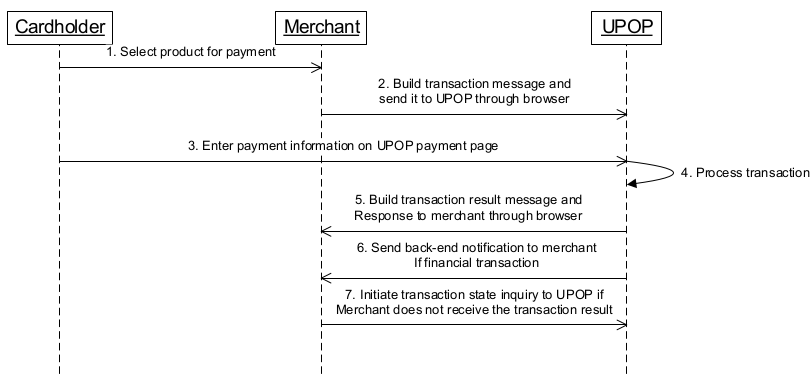

# UnionPay API
[Introduction](#introduction)

[Overview](#overview)

[Setup](#-Setup)

[Configuration](#-Configuration)

[Production Certificates](#-Production-Certificates)

[The base URL](#-The-base-URL)


## <a name="introduction"></a>Introduction

The API will receive union pay credit card transaction requests and return appropriate responses. Requests shall be for purchase, purchase cancellation, transaction query, pre-authorization, pre-authorization complete and pre authorization complete cancellation. 

## <a name="overview"></a>Overview

The UnionPay.php file has the unionpay class that will be used to make request and receive responses from Unionpay. The series of events from initiating the request and receiving a response is depicted in the follow diagram.



## <a name="setup"></a>Setup 
In order to setup the packages run

~~~
composer install
~~~


## Configuration 
The following configuration is required prior to making request and is set in the .ENV file

| Attribute | Value |Comments|
| --------- | ------ | ---------|
| LOGDIR | request_logs | Folder that will have the log files|
| UPOP.CERTID| `69629715588` | The certificate ID that is used. It is preferable to have this as an environment variable |
| UPOP.SMSCODE | 111111 | SMS code is used in combination with account number in the absence of CVV, card expiry and phone number |
| UPOP.SIGNCERT.PWD|000000| The password required to use private key |


## Production Certificates
These certificates are located in the folder
~~~
unionpay/certs/prod
~~~
## The base URL
~~~~
/unionpay
~~~~
## Making a request
A request is made by intiating the Unionpay class and passing the json string to the `makeRequest` function
```php
<?php
	$unionpay = new UnionPay(); //instantiate unionpay class
	$json = file_get_contents('php://input');//get json string
	$unionpay->makeRequest($json); //call function with request
?>
```

## Headers

** Content-Type :** application/json

##### Attributes and their descriptions
| attribute | Description |Type | Requirement |
| --------------- | --------------- | --------------- |
| type| Transaction Type | Numeric | M |
| card| Credit card number | String | M |
| orderId| Order id that is unique | String |  M |
| txnAmt| Transaction amount in cents| Numeric |  M |
|serialno| The queryId retrieved from the backend response |String| M | 
| txnTime| Time when transaction is taking place | String | M |
| smsCode| SMS code sent to customer phone | String | C |
| cvn | card verification number | String | C |
| expiry | Card expiry YYMM | String | C |
| phoneno |Customer phone number used  | String | C |

## POST Purchase
A purchase request 
#### Request
```json
{
    "type": 1,
    "card": "6250947000000014",
    "orderId": "IPAY2020083",
    "txnAmt": 7000,
    "txnTime": "20200107131402",
    "cvn": "123",
    "expiry": "3012",
    "phoneno": "13552535506",
 	"currency": "156"
}
```


## POST Query 
The query request is shown below
```json
{
    "type": 9,
    "orderId": "IPAY2020087",
    "txnTime": "20200116120202"
}
```

## POST Purchase Cancellation
A purchase cancellation request is used to reverse the purchase transaction. The amount is fully or partially reversed as follows
```json
{
    "type": 2,
    "orderId": "IPAY2019094",
    "txnAmt": 1000,
    "txnTime": "20200116140542",
    "serialno": "212001161405422401518"
}
```

## POST Pre-Authorization
The pre authorization request is shown below
```json
{
    "type": 4,
    "card": "8171999927660000",
    "orderId": "IPAY2020092",
    "txnAmt": 1590,
    "txnTime": "20200116141702",
    "cvn": "123",
    "expiry": "3012",
    "phoneno": "13552535506",
 	"currency": "156"
}
```
## POST Pre-Authorization Cancellation

The pre authorization cancellation request is used to reverse the Pre authorization. The amount is fully or partially reversed as follows as follows
```json
{
    "type": 5,
    "orderId": "IPAY2020095",
    "txnAmt": 1590,
    "txnTime": "20200116140642",
    "serialno": "042001161417022386518",
  	"currency": "156"

}
```
## POST Pre-Authorization Complete
```json
{
    "type": 6,
    "orderId": "IPAY2020098",
    "txnAmt": 1590,
    "txnTime": "20200116142021",
    "serialno": "212001161419022512768",
  	"currency": "156"

}
```
## POST Pre-Authorization Complete Cancellation
The pre - authorization cancellation is used to reverse a pre-authorization complete transaction. The amount is fully or partially reversed
```json
{
    "type": 7,
    "orderId": "IPAY2020099",
    "txnAmt": 1590,
    "txnTime": "20200116142526",
    "serialno": "212001161420212126498",
   	"currency": "156"

}
```

### Transaction Types
The following types are used to determine the transaction processing operation to be carried out

|Type|Description|
| ---------- | ---------- |
| 1 | Purchase |
| 2 | CANCELPURCHASE |
| 3 | REFUND |
| 4 | PREAUTH |
| 5 | CANCELPREAUTH |
| 6 | COMPLETEPREAUTH |
| 7 | CANCELCOMPLETEPREAUTH |
| 8 | RECURRING |
| 9 | QUERY |

#### Response (application/json)

#### Attributes and their descriptions
 
| attribute | Description |
| --------------- | --------------- | 
| status| Response code  | 
| description| Response description | 
| queryId| Query idenfier used to search transaction |  
| respCode| Specific union pay response code  | 
#### <a name="pookie"></a> Successful Responses

A json response is returned to the front end as follows


```json
{
"status":"200",
"description":"OK",
"queryId":"402001081314022846518",
"respCode":"00"
>
}
```
#### Failed responses
This is a successful response to the unionpay gateway that has business requirement that is unfulfilled
```
{
"status":"200",
"description":"OK",
"queryId":"042001161417022386518",
"respCode":"35"

}
```
In this case the transaction failed to get processed on the ipay or unionpay gateway
```
{
"status":"400",
"description":"failed",
"respCode":"12"

}
```
## Union Pay Response Codes
The General response code range and their description is given below

| Response code   | Description |
| --------------- | --------------- | 
|00	| Success |
|01-09 | Error due to UPOP system |
|10-29 | Error related to merchant submitted message format checking |
|30-59 | Error related to merchant/acquirer related business checking |
|60-89 | Error related to cardholder or issuer (channel) related problems |
|90-99 | Reserved |

These specific response code appear in the json response with attribute `respCode` that you receive 

| Response code   | Description |
| --------------- | --------------- | 
| 00 | Success |
| A6 | Partial success |
| 01 | Transaction failed. For details please inquire overseas service hotline 1 . |
| 02 | System is not started or temporarily down, please try again later  |
| 03 | Transaction communication time out, please initiate inquiry transaction |
| 05 | Transaction has been accepted, please inquire about transaction result shortly |
| 06 | System is busy, please retry it later. |
| 10 | Message format error |
| 11 | Verify signature error |
| 12 | Repeat transaction |
| 13 | Message transaction key element missing |
| 30 | Transaction failed, please try using other UnionPay card for payment or contact |
| 31 | Merchant state incorrect. The payment is not completed within the order timeout |
| 32 | No such transaction right |
| 33 | Transaction amount exceeds limit |


Also, another response is forwarded to the callback URL provided when making a transaction request. The response is shown below
```
{
"accNo":"r8RCASmopSEvqg5EtLXb2jcfscfp26Nkxboc4Fd7ATUQzSQqqF3j3RX3IAUvlonfuJKIoYI5VG8M5qL0p4nfESts9NEncZBGi47KVqnnJ+Y8jyyaGkexFrjFM/4F5sVdTdQ3NJUDlk9scxbP8KRSPmkLEZyQwobRIl04BvWplleuTpk9RQAcJCmdqiGWoEUuj2KsrEs4N2Evvsxd6Nf+tNerzG8iI/yL4FcJ25QAV6M6ho9nlicekbGhf5MQ6hBD1HzL6Zr5/yPZjQw7b4X7mXJTprw7dUlL141hskFuaXQjeGndxGM3wqtaB7nZwca4t0pgMYUOMplFDAIhwNMMnQ==","accessType":"0","bizType":"000000","currencyCode":"156","encoding":"UTF-8","exchangeDate":"0116","exchangeRate":"71455830","merId":"000000070000017","orderId":"IPAY2020093","payCardType":"02","queryId":"212001161405422401518","respCode":"73","respMsg":"支付卡已超过有效期[1000054]","settleAmt":"146","settleCurrencyCode":"840","settleDate":"0116","signMethod":"01","signPubKeyCert":"-----BEGIN CERTIFICATE-----
MIIEQzCCAyugAwIBAgIFEBJJZVgwDQYJKoZIhvcNAQEFBQAwWDELMAkGA1UEBhMC
Q04xMDAuBgNVBAoTJ0NoaW5hIEZpbmFuY2lhbCBDZXJ0aWZpY2F0aW9uIEF1dGhv
cml0eTEXMBUGA1UEAxMOQ0ZDQSBURVNUIE9DQTEwHhcNMTcxMTAxMDcyNDA4WhcN
MjAxMTAxMDcyNDA4WjB3MQswCQYDVQQGEwJjbjESMBAGA1UEChMJQ0ZDQSBPQ0Ex
MQ4wDAYDVQQLEwVDVVBSQTEUMBIGA1UECxMLRW50ZXJwcmlzZXMxLjAsBgNVBAMU
JTA0MUBaMjAxNy0xMS0xQDAwMDQwMDAwOlNJR05AMDAwMDAwMDEwggEiMA0GCSqG
SIb3DQEBAQUAA4IBDwAwggEKAoIBAQDDIWO6AESrg+34HgbU9mSpgef0sl6avr1d
bD/IjjZYM63SoQi3CZHZUyoyzBKodRzowJrwXmd+hCmdcIfavdvfwi6x+ptJNp9d
EtpfEAnJk+4quriQFj1dNiv6uP8ARgn07UMhgdYB7D8aA1j77Yk1ROx7+LFeo7rZ
Ddde2U1opPxjIqOPqiPno78JMXpFn7LiGPXu75bwY2rYIGEEImnypgiYuW1vo9UO
G47NMWTnsIdy68FquPSw5FKp5foL825GNX3oJSZui8d2UDkMLBasf06Jz0JKz5AV
blaI+s24/iCfo8r+6WaCs8e6BDkaijJkR/bvRCQeQpbX3V8WoTLVAgMBAAGjgfQw
gfEwHwYDVR0jBBgwFoAUz3CdYeudfC6498sCQPcJnf4zdIAwSAYDVR0gBEEwPzA9
BghggRyG7yoBATAxMC8GCCsGAQUFBwIBFiNodHRwOi8vd3d3LmNmY2EuY29tLmNu
L3VzL3VzLTE0Lmh0bTA5BgNVHR8EMjAwMC6gLKAqhihodHRwOi8vdWNybC5jZmNh
LmNvbS5jbi9SU0EvY3JsMjQ4NzIuY3JsMAsGA1UdDwQEAwID6DAdBgNVHQ4EFgQU
mQQLyuqYjES7qKO+zOkzEbvdFwgwHQYDVR0lBBYwFAYIKwYBBQUHAwIGCCsGAQUF
BwMEMA0GCSqGSIb3DQEBBQUAA4IBAQAujhBuOcuxA+VzoUH84uoFt5aaBM3vGlpW
KVMz6BUsLbIpp1ho5h+LaMnxMs6jdXXDh/du8X5SKMaIddiLw7ujZy1LibKy2jYi
YYfs3tbZ0ffCKQtv78vCgC+IxUUurALY4w58fRLLdu8u8p9jyRFHsQEwSq+W5+bP
MTh2w7cDd9h+6KoCN6AMI1Ly7MxRIhCbNBL9bzaxF9B5GK86ARY7ixkuDCEl4XCF
JGxeoye9R46NqZ6AA/k97mJun//gmUjStmb9PUXA59fR5suAB5o/5lBySZ8UXkrI
pp/iLT8vIl1hNgLh0Ghs7DBSx99I+S3VuUzjHNxL6fGRhlix7Rb8
-----END CERTIFICATE-----","traceNo":"240151","traceTime":"0116140542","txnAmt":"1000","txnSubType":"01","txnTime":"20200116140542","txnType":"01","version":"5.1.0","signature":"HGFpQEzXkJLRhE1xnq9bQYUu1LvBKPEdFA74TmfMdSLMSdgB55ZhAxVu2dp46a/hEgFZrvcFaZ9eyXndFeD0kCdsspl2405NzFgU0XnDEUxj627tHyQBKmJaon8L3hJ9Wbi8ND7Mbc+mIEhxa+1+Rm/nE+Bm5a+IZZ2oy3bxloHOqrjcuBIpM73rC4gmNdBo+yxj8ZkcYTcKY6VsSyYj5XDO2IHCZtGjHBgcHSL0hLIxHmFxal6Hhjvk3jsiHTb5oV/zN2W7fuxzvy9Lr9HGbUkYChVU83Vyh5W2LtR7bph05bbjKq5HwHJd87mRDfxKfyPXTYQFf1QC+/+PTXRzmw=="
} 
```

